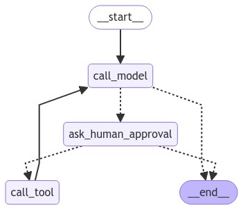

### langgraph_gen
Slightly modified examples from langgraph, all graph code for nodes/edges generated.

Nodes mostly unchanged, take 'state' parameter.

Conditional edges simplified, edge traversal determined by boolean function that takes 'state' as parameter.

### state-model.ipynb [](https://colab.research.google.com/github/jojohannsen/langgraph_gen/blob/main/state-model.ipynb)

```python
graph_spec = """

call_model(AgentState)
  no_tools => END
  => call_tool

call_tool
  => call_model
  
"""
```

### wait-user-input.ipynb [](https://colab.research.google.com/github/jojohannsen/langgraph_gen/blob/main/wait-user-input.ipynb)

```python
graph_spec = """

call_model(MessagesState, memory)
   no_tools => END
   human_needed => get_human_input
   => tool_node

tool_node
   => call_model
   
get_human_input
   => call_model
   
"""
```

### human-in-loop.ipynb [](https://colab.research.google.com/github/jojohannsen/langgraph_gen/blob/main/human-in-loop.ipynb)
  
```python
  graph_spec = """
   
call_model(AgentState)
    should_call_tool => ask_human_approval
    
ask_human_approval
    human_allows_tool_call => call_tool
    
call_tool
    => call_model

"""
```




